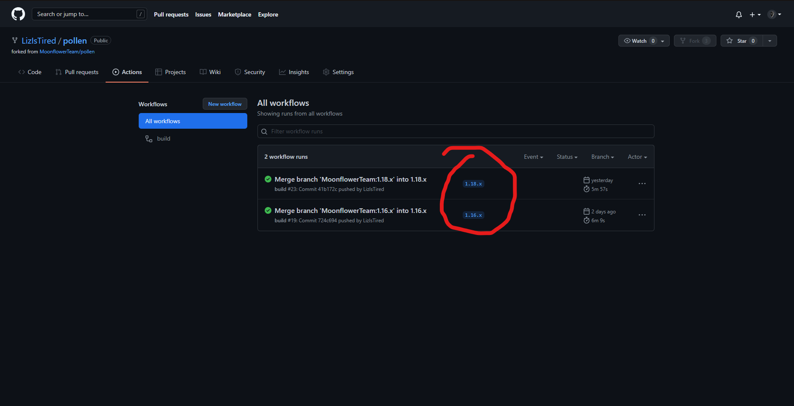

 IMPORTANT: This is an unofficial fork and will not be supported on the official moonflower Discord nor will it be supported by the developers of Pollen. Use at your own risk.
 ___
This fork exists only as an easy way to build and distribute the Pollen API, since everyone I've found has no idea how to build using Architectury.
___
Instructions
=
1. Set up a 1.18.1 Fabric or Forge instance, if you don't have one already.
2. Go to https://github.com/LizIsTired/pollen/actions (this repo) and click one of the top most boxes, scroll down and click either choose what Minecraft version you want to download Pollen for (1.16.x/1.18.x) in the "Artifacts" section.
3. Choose the mod loader version you're using, if you're using Forge, use the Forge version and use the Fabric version if you're using Fabric.
4. Extract those .zip files and move the .jar file inside to your mods folder.
5. Congratulations! You now have the required library for the moonflower team's mods! The only one you can access at this moment of time (11/01/2022) is the unreleased Trainguys's Animation Overhaul, which has a system identical to this one, so repeat steps 2-4 but using https://github.com/Trainguy9512/trainguys-animation-overhaul/actions instead. This mod, Pollen, adds nothing to the game itself.